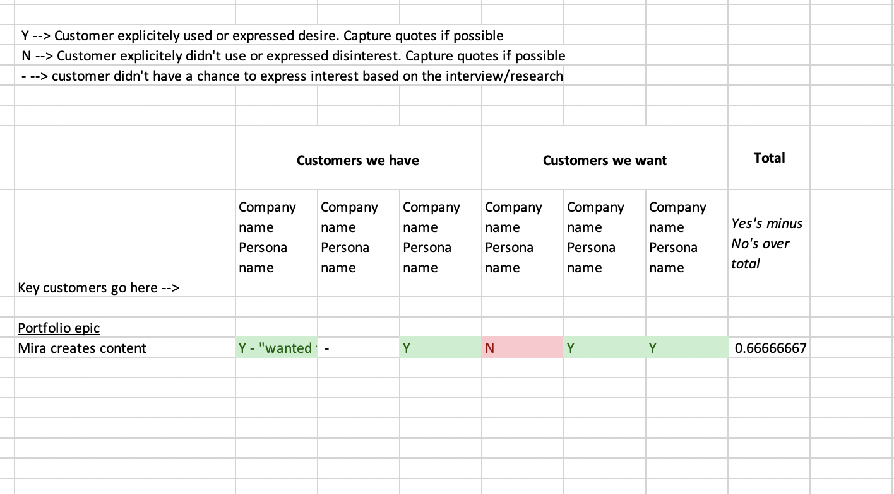

# Periodic Strategic Planning

### Introduction / problem statement

Our team has been doing a quarterly planning exercise for over a year now to check in on our larger portfolio objectives. In the quarterly planning we strive to identify the **3-month-or-less tasks (_epics_) that each team can accomplish in the quarter** and similarly identify the tasks for the following quarter to help prioritize designers ahead of where the production is. While this is effective to check in on existing long range designs & plans (_portfolio epics_) it does not foster a level of prioritzation & strategic thinking that allows new multi-quarter objectives. 

This brief write-up outlines a few ideas on how to elevate our quarterly planning to the highest level of decision making while also staying grounded in our customer's voice. I will outline what I think could be an effective way to blend business objectives (_gut feels in some cases_) with the existing qualtatative research to arrive at an update to our overall long term strategy. Hopefully this can then be used in the next 1-3 quarterly plannings until a new long range planning is required and this exercise useful again.

As a background on the terms in this document, our team uses:
 - Portfolio Epics: An issue in the issue management system that represents a broad multi-quarter strategy. **We have not defined portfolio epics formally enough and I believe we need to in order to proceed clearly**
 - Epics: an issue representing work that can be completed in less than 3 months
 - Features: an issue representing a functional area of the application
 - Stories: an issue representing user-facing functionality that can be accomplished in less than a week

### Part I: Ahead of time - cleaning up portfolio epics

#### a. Remove portfolios that don't meet a more formal definition

Let's try to formally define a portfolio epic to make our lives easier ahead of time. I don't think this needs to be defined as a group...but rather more formally defined for those on the team writing these issues. 

A porfolio epic is either
 - an expansion to the application's domain model
 - a renovation / reimagination of existing functionality that effects multiple features spanning multiple quarters

In my evaluation good porfolio epics we have today are:
 - _Expansion example_: "Individual & Team Workspaces" 
 - _Renovation exmaple_: "Hub content have enhanced views"

Portfolio epics that could use "elevation" (they're too epic-y) are:
 - "Content Search with Collections and Maps"
 - "Feedback v2 - dedicated survey view"

We don't want to duplicate epics at the higher level becaue they aren't serving the purpose of strategically guiding our work. If we do we'll find ourselves with the same problem of trying to prioritize by just looking at epics--there's too many to meaningfully change the macro strategy of our product backlog.

**ACTION: Out of this step your existing in-flight & backlogged portfolios should pass the definition test.**

_Side note: this is not to say the energy & thoughts that went into the epic-y portfolios is bad or anyone did anything wrong--I think portfolio epics came into existence without enough planning up front. If we set a definition make sure to emphasize that it did not exist before and there was previously no wrong answer_

#### b. Exhaust possible new strategies

Prepare yourself for coming up with high level directions the product can take. Do this by reviewing several existing resources. 

* Review existing portfolio epics
* Review dovetail tags charts and add missing portfolios bundling similar existing needs
* Review competitive analysis / market analysis / gut feels for where the product should go that isn't reflected by the users we have and make sure these are represented

Come up with the shortest representation/titles possible for these strategies. The details will come later. They will be easier to sort and work with if they can be expressed simply.

**ACTION: Create missing porfolio epics**

#### c. Understand the team's capacity for new strategies

We don't need a portfolio epic for everything that's happening. We can account for it in a different way: Leveraging a domain model or other diagram representing the existing product and mark the resources (# developers) that are/will be supporting existing functionality in the next quarter. These can be planned using the normal quarterly planning approach via epics (_planning 3-6 months ahead for those via. epics_). This is where we can turn our attention to the level of granularity in each of those areas with resources attached (_what is the next big thing for ____ feature based on our research_)

With this in mind, how much of the team's capacity is free now? How much of the capacity is free in 3 months? Which areas of the product will continue to hold our team's attention for the next several quarters vs. predicted to wrap up. Things that wrap these are usually major projects that conclude this/next quarter or features that are mature enough to stop progress on

**ACTION: Come away from this step with a percent time available for new strategies**

_Side note: When reviewing this information with the team at large - remind folks that as products grow complex we support more and more features. The amount of net new strategies that a team can take on will decrease as a product grows more complex. While the rest of this document will focus on the newer strategies, we are not talking about this large % because they have already made it through this upstream process. Everything is important and where we spend the strategic planning time is not reflective of what we think is important._

### Part II: Prioritize the portfolio epics that are not yet started

[Try to focus on 7 or fewer portfolio epics](https://en.wikipedia.org/wiki/Working_memory#Capacity). It's hard to make tradeoff decisions with too many things to keep in mind.

Once you have the epics you want to evaluate against each other, it's time to dive into our research system. 

1) Select the customers that are representative of existing and potential markets
2) Evaluate the research you have to determine how those customers feel about each of those portfolio epics
3) Mark your findings somewhere (dovetail or excel...some suggestions below)
4) Blend in priorities not reflected through traditional research methods. Determine how much voting power / weight those extra priorities will have

For this I suggest a spreadsheet so you can quantify qualitative data. Dovetail itself can do this via the tagging & charting for the research that is in dovetail already...but because we may be evaluating priorities we don't have data for it might be useful to pull the data out.

Here is how I have done it in the past

</img>

### Part III: Review findings and approach with product leaders. 

The review should outline the efforts along the way and what got to this step. After review have everyone open the spreadsheet and take a look at the results. Focus the review around these questions:

 - Is there a customer not being represented in this prioritization (i.e. have we thought only about civic/local governments and not represented non-profits and commercial companies)
 - Is there a portfolio that is missing that should be represented here (for this - I would exclude technology projects)
 - Given the estimated amount of capacity, how many additional strategies can the team support? Do we agree with the capacity statments at this & next quarter? 

 The beauty of doing any adjustments is with enough excel conditional formatting and formulas it's not hard to make edits on the fly. 

 **ACTION: Meet and review the results. Selecting new strategies based on hybrid research/business prioritization. Re-enforce existing strategies. Do normal quarterly planning with this renewed context**

### Disclaimer

....or not. I believe strongly that we should try things then revisit this approach to see how we can improve the way we make decisions.
